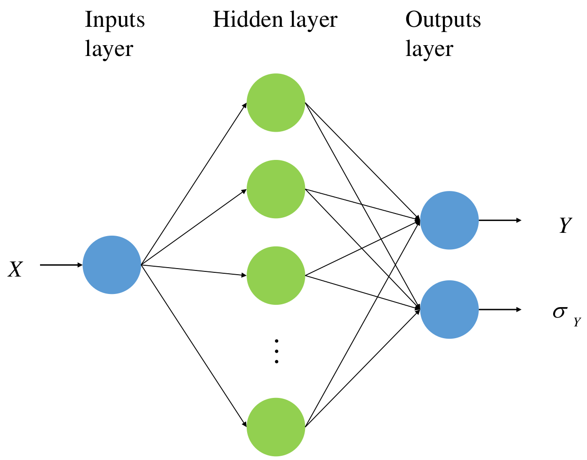
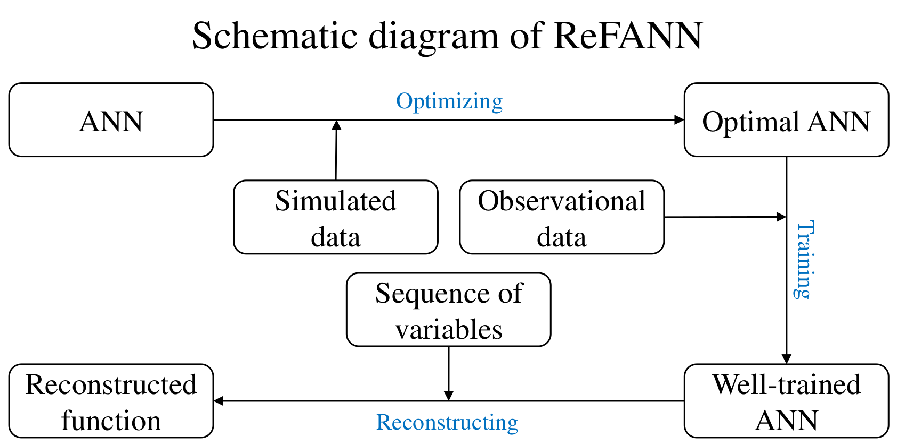

.. _introduction:

Introduction
************

ReFANN is designed to reconstruct functions from the observational data sets, which has no assumption of models or parameterization, and is a completely data-driven approach.

This part will briefly show you the basic principle of ReFANN, however, we recommend that readers read our published `paper <https://arxiv.org/abs/1910.03636>`_ for more details.

Network architecture
====================

An ANN, also called a neural network (NN), is a mathematical model that is inspired by the structure and functions of biological NNs, and it generally consists of an input layer, hidden layers, and an output layer. 

The ANN, composed of linear and nonlinear transformations of input variables, has been proven to be a “universal approximator”, which can represent a great variety of functions. The ANN aims to make a mapping from the input data to the output data; thus, for the task of function reconstruction, the ANN actually learns a mapping between the variables and the corresponding measurement.

The network structure used in ReFANN is a single fully connected network with one layer (or a few hidden layers), which is usually called multilayer perceptron (MLP, see Figure 1 below). MLP can accept a set of variables as inputs and output the corresponding measurement and its errors.

    Figure 1. General structure of an MLP used in ReFANN.

Training & Reconstruction
=========================

The training process (or the working principle) of ReFANN is shown in the schematic diagram below. The key steps of reconstructing functions using ReFANN are as follows:

1. Optimize hyperparaemters (such as the number of neurons in the hiddel layer, the batch normalization and the number of iteration, etc.) of ANN using simulated data to find an optimal ANN model.

2. Train the optimal ANN model using observational data.

3. Predict (or reconstruct) function using the well-trained ANN model by feeding a sequence of variables to the network.

