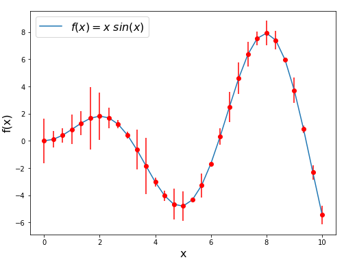
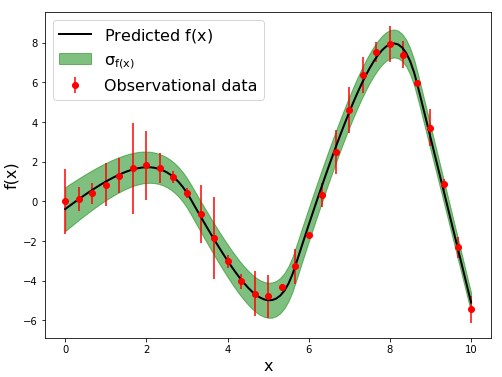

.. _quickStart:

Quick Start
***********

Here we show one example to illustrate how ReFANN works, and the readers can archieve their project quickly by modifing the example. The code used to generate the example can be downloaded `here <https://github.com/Guo-Jian-Wang/refann/tree/master/examples>`_.

The main process of using ReFANN includes optimizing hyperparameters (such as the number of neurons in the hidden layer, the batch normalization and the number of iteration, etc.) of ANN using simulated data, training the optimal ANN model using observational data, predicting (or reconstructing) function using the well-trained ANN model.

Let's consider a general case:

.. math::
    f(x) = x sin(x)

where `x` is the variable, and `y` is the measurement. We first simulate a sample using the function below::

    import numpy as np
    import matplotlib.pyplot as plt
    
    def func(x):
        return x * np.sin(x)
    
    x = np.linspace(0, 10, 31)
    y = func(x)
    np.random.seed(1)
    err_y = np.abs(np.random.randn(len(y)))
    
    plt.figure(figsize=(8,6))
    plt.plot(x, y, '-', label='$f(x)=x\ sin(x)$')
    plt.errorbar(x, y, yerr=err_y, fmt='ro')
    plt.xlabel('x', fontsize=16)
    plt.ylabel('f(x)', fontsize=16)
    plt.legend(fontsize=16)
    

After that, we should optimize the hyperparameters of the ANN (such as the number of neurons in the hidden layer, the batch normalization and the number of iteration, etc.) to find an optimal ANN model. We recommend readers read our published `paper <https://arxiv.org/pdf/1910.03636.pdf>`_ (section 2.3) for more details about optimizing the ANN model. Here we use the default settings of ReFANN. Specifically, the network has one hidden layer, the number of neurons in the hidden layer is 4096, the ``hp_model='rec_1'`` (there is no batch normalization), and the number of iteration is 30000.

Then, we can build a reconstructor and pass the data to it to train the network::

    import refann as rf
    
    data = np.c_[x, y, err_y]
    
    reconstructor = rf.ANN(data, mid_node=4096, hidden_layer=1, hp_model='rec_1')
    reconstructor.iteration = 30000
    reconstructor.train()

Finally, we pass a sequence of variables to the reconstructor to reconstruct a function::

    func = reconstructor.predict(xpoint=np.linspace(0, 10, 101))
    #func = reconstructor.predict(xspace=(0, 10, 101)) #or use this
    reconstructor.save_func(path='rec_1', obsName='xsin') #save the reconstructed function
    reconstructor.plot_func()

